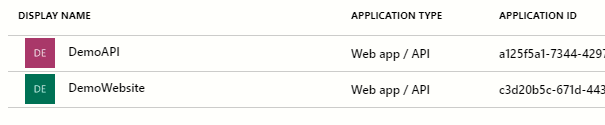
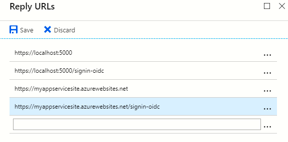
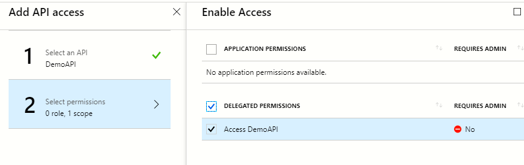

# Minimal repository

In this repository you'll find a demostration of the issue described [here](https://github.com/AzureAD/azure-activedirectory-library-for-dotnet/issues/) for the [ADAL.NET](https://github.com/AzureAD/azure-activedirectory-library-for-dotnet) project.

## How to configure AAD

For this project to run you'll need to register two apps on your AAD instance. If you don't have an AAD instance you'll have to [create](https://portal.azure.com/#create/Microsoft.AzureActiveDirectory) one before starting. 

1. Go to your [AAD](https://aad.portal.azure.com/#blade/Microsoft_AAD_IAM/ActiveDirectoryMenuBlade).
2. From the menu on the left select *App registrations*.
3. Click on the *+ New application registration*.
4. Register an application for the website.
    - Make sure you have selected *Web app / API* from the Application type dropdown.
    - The sing-on URL I used https://localhost:5000 since thats the site/port from which I'll access the application.
5. Register a second application for the API.
    - For the sign-on URL I used https://localhost:5001 but it doesn't matter. This is used only to generate an access token from the website to access (in case that existed) another resource.
> *It should look something like this*:



6. Copy the Website Application ID to the appsettings.json/appsettings.development.json file. It goes as *ClientId*.
7. Copy the API Application ID to the appsettings.json/appsettings.development.json file. It goes as *ApiKey*.
8. Add the reply urls to the website.
    - Click on the website registration then go to *Settings > Reply Urls*
    - Add the url to your application and the signin-oidc endpoint. 
    
    **The url should match your application host**.
9. Link the website to the API.
    - Click on the website registration then go to *Settings > Required Permissions*.
    - Click the *+ Add* button.
    - Click on *Select an API*, search your API's name **using the search bar** and select it.
    - Enable the permit to access it from the website as shown below.
    
    - Click *Done*.

10. Create a secret key.
    - In the website registration go to *Settings > Keys*
    - Type a name for your key.
    - Select a duration
    - Click *Save*.
    - The key value will be displayed, copy it.
11. Add the copied key value to the appsettings.json/appsettings.development.json file. It goes as *ClientSecret*.
12. Add the tenant to the settings. If you don't know where to find it, follow [this link](https://aad.portal.azure.com/#blade/Microsoft_AAD_IAM/ActiveDirectoryMenuBlade/Domains) and it should be under the column *Name*.

Make sure to fill these fields inside the settings file.

```json
  "AzureActiveDirectoryOptions": {
    "ClientId": "<Website Application ID>",
    "ClientSecret": "<Website Secret Key>",
    "Tenant": "<Azure Active Directory Tenant>",
    "AadInstance": "https://login.microsoftonline.com/{0}/v2.0",
    "ApiKey": "<Application ID of your API>"
  }
```
